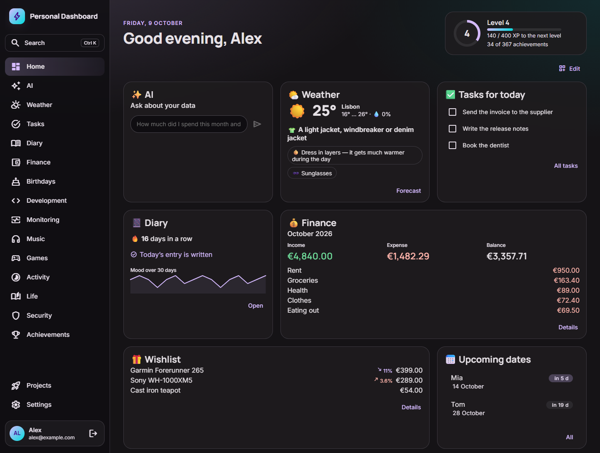

# Personal Dashboard

A self-hosted dashboard for your daily life: birthdays, personal and project finances, website
monitoring, open source stats, a diary, music, games, personal achievements — and an AI assistant
that can answer questions about all of it. Notifications arrive in Telegram.

It runs as a website, as a desktop app (Windows / macOS / Linux, with tray and autostart) and as a
single Docker image on your server. Every feature is a module: enable, disable or write your own.



**Stack:** Nx · Angular 22 + Angular Material · NestJS 11 · PostgreSQL + Drizzle ORM · pg-boss · grammY · Electron

## Features

| Module          | What it does                                                                                                                                                                                                                                                                                                                                                |
| --------------- | ----------------------------------------------------------------------------------------------------------------------------------------------------------------------------------------------------------------------------------------------------------------------------------------------------------------------------------------------------------- |
| ✨ AI           | Chat about your own data (DeepSeek, OpenAI, Ollama or any OpenAI-compatible API), `/ask` in Telegram, a morning digest at the time you choose, weekly diary summaries                                                                                                                                                                                       |
| 🌤️ Weather      | Today's forecast and the week ahead for your city (Open-Meteo, no API key): feels-like temperature, precipitation, wind, UV, hourly view and what to wear, tuned to how you take the cold; also in the morning digest                                                                                                                                       |
| ✅ Tasks        | A TODO list (due dates, priorities, checklists, lists and tags, repeating tasks) and reminders at your local time — one-off or repeating, snoozed from Telegram buttons; `/todo`, `/remind`, `/tasks`                                                                                                                                                       |
| 📔 Diary        | Visual Markdown editor per day, autosave, mood, #tags, emoji marks on phrases (`==🔥 text==`), photos, search, year heatmap, “on this day”, mood insights; Telegram `/d`, `/mood`, `/today`, photos                                                                                                                                                         |
| 💰 Finance      | Income and expenses per wallet, totals in your main currency (ECB rates), top categories, recurring payments, automatic cost import from Hetzner Cloud and DeepSeek                                                                                                                                                                                         |
| 🎂 Birthdays    | Countdown and age, reminders N days ahead                                                                                                                                                                                                                                                                                                                   |
| 👨‍💻 Development  | Open source: your public repositories on GitHub, GitLab and Bitbucket and those of your organizations appear by themselves (stars, forks, issues, PRs, releases, npm downloads; alerts for the ones you mark), your accounts on these services (contribution calendar, streaks, languages) — each on its own and all as one — and coding time from WakaTime |
| 📡 Monitoring   | Uptime checks every 5 minutes, uptime for 24 h / 7 / 30 days, response time chart, SSL expiry; “down / back up” alerts and SSL reminders                                                                                                                                                                                                                    |
| 🎧 Music        | Last.fm listening history, plays per day, top artists / tracks / albums; Spotify “now playing”; your own SoundCloud tracks with plays, likes, reposts and comments day by day                                                                                                                                                                               |
| 🎮 Games        | Steam (level, hours and achievements per game across your accounts), Dota 2 (the 500 latest matches from Steam, complemented by OpenDota: medal, win rate, heroes) and World of Warcraft via Battle.net (character, item level, achievements)                                                                                                               |
| 🏆 Achievements | 42 personal achievements across all modules, with tiers and progress                                                                                                                                                                                                                                                                                        |
| 🚀 Projects     | Your websites and services — finance, monitoring and AI refer to them                                                                                                                                                                                                                                                                                       |

The UI, notifications and AI answers are available in **English** and **Russian**.

Everyday comfort: a command palette (Ctrl+K) that opens any page and searches all your data,
themes (light / dark, any accent colour, fonts, density), a home page you arrange yourself, and an
installable app (PWA) that opens offline and sends your changes when the connection is back.

Security: short-lived access tokens with the refresh token in an httpOnly cookie, a list of signed-in
devices, two-factor sign-in (an authenticator app, recovery codes), throttled sign-in, a 30-day trash
for everything deleted (by you or by the AI), an AI action log and per-module switches of what the
AI may see.

## Quick start (development)

Requirements: Node.js 24+ and Docker.

```bash
npm install
cp .env.example .env          # set JWT_SECRET, ENCRYPTION_KEY, ADMIN_EMAIL, ADMIN_PASSWORD
npm run db:up                 # PostgreSQL in Docker
npm run dev                   # API on :3300 + web on http://localhost:4200
```

Sign in with `ADMIN_EMAIL` / `ADMIN_PASSWORD` — the user is created on the first start. Database
migrations are applied automatically when the API starts.

> If port 5432 is taken by another PostgreSQL, set `DB_PORT=5433` in `.env` and update the port in `DATABASE_URL`.

## Self-hosting

The whole app is one Docker image: the API also serves the built frontend.

```bash
cp .env.example .env          # fill in the values
docker compose up -d --build  # database + app on :3300
```

Put a reverse proxy with HTTPS in front of it (Caddy, Traefik, nginx) and set `PUBLIC_URL` to the
public address. Background jobs (reminders, uptime checks, syncs) run in the same container; if the
server was down when a job was due, it runs once after start.

**Local + server:** run the dashboard on your computer (works offline) and a copy on a server
(access from anywhere, Telegram bot); the two databases sync both ways — see [docs/sync.md](docs/sync.md).
Step-by-step server setup (Caddy with HTTPS, daily backups, updates): [docs/deploy.md](docs/deploy.md).

Prebuilt images (amd64 and arm64) are published to GitHub Container Registry on every push to
`main` (tag `main`) and every release (`latest`): `ghcr.io/romanrostislavovich/personal-dashboard`.

## Desktop app

Installers for Windows, macOS and Linux are attached to [GitHub Releases](../../releases). On the
first start the app asks for the server URL — your server or a local Docker (`http://localhost:3300`).
The tray menu has “Start with the system” and “Change server”.

```bash
npm run dev:desktop           # Electron on top of the dev server
npm run desktop:package       # build an installer → dist/desktop-installers
```

## Integrations

Everything is connected in one place: **Settings → Integrations**. All tokens entered there are
stored encrypted (AES-256-GCM with `ENCRYPTION_KEY`) and are never sent back to the browser.

| Integration       | How to connect                                                                                                                                                         |
| ----------------- | ---------------------------------------------------------------------------------------------------------------------------------------------------------------------- |
| Telegram          | Create a bot with [@BotFather](https://t.me/BotFather), set `TELEGRAM_BOT_TOKEN`, then “Connect Telegram”                                                              |
| AI                | Add a connection: provider (DeepSeek by default), model, API key. Add several and switch in one click. For full privacy use Ollama                                     |
| GitHub            | A classic token with `read:user`, `repo` and `read:org`: your public repositories, organizations and account statistics                                                |
| WakaTime          | The secret API key from wakatime.com → Settings → Account; days are copied to the dashboard, so history outlives the free plan                                         |
| Hetzner Cloud     | Cost import → a project API token with Read access                                                                                                                     |
| DeepSeek costs    | Cost import → an API key; spending is derived from balance changes                                                                                                     |
| Last.fm           | Username + API key from [last.fm/api/account/create](https://www.last.fm/api/account/create)                                                                           |
| Spotify           | Create an app at developer.spotify.com, Redirect URI = `PUBLIC_URL` + `/api/music/spotify/callback`, set `SPOTIFY_CLIENT_ID/SECRET`                                    |
| Steam             | A Web API key from steamcommunity.com/dev/apikey (one for all accounts), then add your profiles on the Games page                                                      |
| Dota 2            | Games → Steam ID or profile link; enable “Expose Public Match Data” in Dota. Matches come from Steam (with the key above); an OpenDota API key per account is optional |
| World of Warcraft | Battle.net client ID and secret from develop.battle.net, then Games → region / realm / character                                                                       |

Telegram bot: just write to it — the AI assistant answers and can do almost anything the dashboard can on request: add, edit and delete birthdays, diary entries, transactions, recurring payments, projects, monitored sites, repositories and game accounts (it asks before deleting anything; keys and tokens are set up only in the dashboard). Commands: `/d text` — add to today’s diary entry, `/mood 1–5` — rate the day, `/today` — show today’s entry, `/ask question` — a one-off question, `/new` — start a new conversation (the conversation is shared with the AI chat of the dashboard and kept across restarts), `/model` — list the saved AI connections, `/model 2` — switch to the second one. A voice message is turned into text (with an OpenAI connection, see Settings → Integrations) and handled like a typed one. A photo sent to the bot goes into today’s entry; a file (PDF, Excel, CSV, text) goes to the assistant — send a bank statement and its transactions land in finance. Files can be attached in the AI chat of the dashboard too.

## Configuration

See [`.env.example`](.env.example). The most important variables:

| Variable             | Description                                           |
| -------------------- | ----------------------------------------------------- |
| `DATABASE_URL`       | PostgreSQL connection string                          |
| `JWT_SECRET`         | Secret for sign-in tokens, at least 32 characters     |
| `ENCRYPTION_KEY`     | Key for integration tokens in the DB — do not lose it |
| `APP_TIMEZONE`       | Time zone of daily jobs, e.g. `Europe/Berlin`         |
| `ALLOW_REGISTRATION` | `true` to let other people sign up (off by default)   |
| `DEFAULT_LOCALE`     | Language of the first user: `en` or `ru`              |
| `PUBLIC_URL`         | Public address of the dashboard (OAuth callbacks)     |

## Commands

| Command                     | What it does                                         |
| --------------------------- | ---------------------------------------------------- |
| `npm run dev`               | API + web in development mode                        |
| `npm run dev:desktop`       | Desktop shell on top of the dev server               |
| `npm run db:up`             | Start PostgreSQL in Docker                           |
| `npm run db:generate`       | Create an SQL migration after changing `*.schema.ts` |
| `npm test` / `npm run lint` | Tests / linter for all projects                      |
| `npm run build`             | Production build of API and web                      |
| `npm run desktop:package`   | Build a desktop installer                            |

## Architecture

```
apps/
  api/        NestJS host: only wires the core and the enabled modules (src/modules.ts)
  web/        Angular host: only wires the core and the enabled modules (src/app/modules.ts)
  desktop/    Electron shell: tray, autostart, server selection
libs/
  shared/contracts/   shared types and zod schemas for API and web
  api/core/           backend core: DB, auth, projects, scheduler, notifications, secrets,
                      achievements engine, AI gateway
  client/core/        client core for every client (web, desktop, mobile): session, every API
                      request, live events, locale — plain TypeScript
  web/core/           frontend core: layout, auth, i18n, home page with widgets, module SDK
  modules/<name>/api  backend of a module
  modules/<name>/web  frontend of a module
```

Modules depend only on the core and contracts — never on each other (enforced by ESLint). A module
can add its own pages, widgets, background jobs, notifications, Telegram commands, achievements and
AI tools. See [docs/architecture.md](docs/architecture.md) for details and a step-by-step guide to
writing a module, and [docs/roadmap.md](docs/roadmap.md) for what is next.

## Contributing

Contributions are welcome — see [CONTRIBUTING.md](CONTRIBUTING.md). Please report security issues
privately as described in [SECURITY.md](SECURITY.md).

## License

[MIT](LICENSE)
